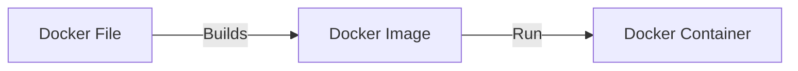

Links: [[EAD|HomePage]]
# Docker
*Docker* is an open platform for developing, shipping, and running applications. *Docker* enables you to separate your applications from your **infrastructure** so you can deliver software quickly. With *Docker*, you can manage your **infrastructure** in the same ways you manage your applications. *Docker* takes away **repetitive**, **mundane** **configuration** **tasks** and is used throughout the development lifecycle for fast, easy and portable *application development.*

### Architecture
Docker is a tool designed to make it easier to create, deploy, and run applications by using containers. Containers allow a developer to package an application with all of the parts it needs, such as libraries and other dependencies, and ship it all out as one package.

Docker uses a client-server architecture. The Docker _client_ talks to the Docker _daemon_, which does the heavy lifting of building, running, and distributing your Docker containers. The Docker client and daemon _can_ run on the same system, or you can connect a Docker client to a remote Docker daemon. The Docker client and daemon communicate using a REST API, over UNIX sockets or a network interface. Another Docker client is Docker Compose, that lets you work with applications consisting of a set of containers.

![[Screenshot 2022-11-17 at 11.08.26 AM.jpg]]
---



#### Dockerfile
A `Dockerfile` is a text file that contains the instructions for building a Docker image. It specifies the base image to use, any packages or dependencies that need to be installed, and any additional commands or configurations that are needed to set up the environment.

Some of the instructions are:
- Base Image
- Copy Code
- Execute Code

<u>Example:</u>
```DockerFile
FROM mcr.microsoft.com/dotnet/sdk:6.0

COPY *.csproj ./
RUN dotnet restore

COPY ../*.cs ./
COPY ../Properties ./

RUN dotnet publish -c Release

FROM mcr.microsoft.com/dotnet/runtime:6.0

COPY ./bin/Release/net6.0/publish app/
WORKDIR /app

ENTRYPOINT ["dotnet", "app.dll"]
```

#### Docker Image
When Docker file executes, it generates a docker image. An _image_ is a read-only template with instructions for creating a Docker container. Often, an image is _based on_ another image, with some additional customization. For example, you may build an image which is based on the `ubuntu` image, but installs the Apache web server and your application, as well as the configuration details needed to make your application run.

#### Docker Container
A `container` is a runnable instance of an image. You can create, start, stop, move, or delete a container using the Docker API or CLI. You can connect a container to one or more networks, attach storage to it, or even create a new image based on its current state.

By default, a `container` is relatively well isolated from other containers and its host machine. You can control how isolated a container’s network, storage, or other underlying subsystems are from other containers or from the host machine.

A `container` is defined by its image as well as any configuration options you provide to it when you create or start it. When a container is removed, any changes to its state that are not stored in *persistent storage disappear.*

```ad-note
_A container is a runnable instance of an image_. You can create, start, stop, move, or delete a container using the Docker API or CLI.
```

#### Steps to Dockarize a `.Net` app
1. Write click on project on side pane.
2. Select *Realese as Folder.*
3. Select the *destination path.*
4. Other default setttings and *Publish.*
5. Wtite *Dockerfile.*
6. Run Following Commands in Terminal
	- `docker build -t myimage -f Dockerfile .`
	- `docker images`
	- `docker run myimage`

#### Steps to publish a `docker image `on the repository
1. Create Repository on Docker Hub.
2. Tag Your docker image using the following command
 docker image tag `image-name` *username*/*repository-name*:latest
 3. Push the image to the repository using the following command
 docker image push --all-tags  *username*/*repository-name*

#### A list of some of the most important Docker commands:

1.  `docker build`: Build an image from a Dockerfile.
2.  `docker run`: Run a command in a new container.
3.  `docker ps`: List all running containers.
4.  `docker stop`: Stop a running container.
5.  `docker rm`: Remove a stopped container.
6.  `docker rmi`: Remove an image.
7.  `docker pull`: Pull an image from a registry.
8.  `docker push`: Push an image to a registry.
9.  `docker images`: List all images.
10.  `docker exec`: Run a command in an existing container.
11.  `docker commit`: Create a new image from a container's changes.


---


```chartsview
#-----------------#
#- chart type    -#
#-----------------#
type: WordCloud

#-----------------#
#- chart data    -#
#-----------------#
data: "wordcount:Docker"

#-----------------#
#- chart options -#
#-----------------#
options:
  wordField: "word"
  weightField: "count"
  colorField: "count"
  wordStyle:
    rotation: 30
```

Created: 2022-11-17