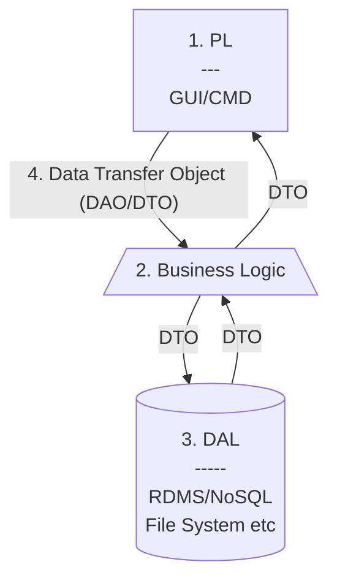

Links: [[EAD|HomePage]]
# N-Tier Architecture
- Dividing Application into n layers (conceptual). *n is just an arbritary number!* Layers Could include but not restricted to:
	1. I/O Layer or Presentation Layer (PL)
	2. Business Logic (BL)
	3. Storage or Data Access Layer (DAL)
	4. Data Transfer Object (DTO)^[DTO (Data Transfer objects) is a data container for moving data between layers. They are also termed as transfer objects. DTO is only used to pass data and does not contain any business logic. They only have simple setters and getters.]

<u>There are many benefits to using an N-tier architecture, including:</u>
1. **Scalability:** N-tier architectures are highly scalable, meaning that they can be easily expanded to support more users or more functionality without needing to re-architect the entire system.
2. **Flexibility:** N-tier architectures are also very flexible, allowing you to easily modify or add new functionality without affecting the rest of the system.
3. **Redundancy:** N-tier architectures can provide built-in redundancy, meaning that if one component fails, the others can continue to operate. This can improve availability and uptime.
4. **Security:** N-tier architectures can offer improved security, as each component can be isolated from the others and given its own security controls

<u>There are some potential drawbacks to using an N-tier architecture:</u>
1. **Increased complexity:** An N-tier architecture can be more complex than a single-tier or two-tier architecture, since there are more components and interactions between those components. This can make it more difficult to develop, deploy and manage an N-tier system.
2. **Performance issues:** N-tier architectures can suffer from performance issues, since data has to be passed between the different tiers. This can be especially troublesome if data is being passed between tiers that are located on different servers (or even different geographical locations).
3. **Reduced flexibility:** An N-tier architecture can also reduce flexibility, as changes in one layer can affect other layers.
4. **Security risks:** An N-tier system can also be more vulnerable to security attacks, since there are more potential entry points for hackers. Additionally, if one tier

---

> Give whatever you are doing and whoever you are with the gift of your attention.
> — <cite>Jim Rohn</cite>

Created: 2022-11-01