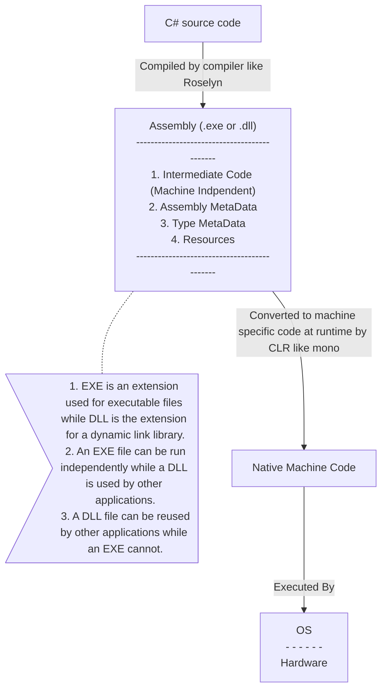

Links: [[EAD|HomePage]]
## Compilation Process

1. C# Source code
2. compiler (Roselyn). There are other langauges in .NET, every language has its own compiler.
	- F# -- f# compiler
	- Vb.net -- Vb.net compiler
3. Assembly (`.dll or .exe`)
	1. *Intermediate language:* intermediate code ( it is converted to machine specific code at runtime by "Common Language Runtime CLR")  CLR^[The Common Language Runtime, the virtual machine component of Microsoft .NET Framework, manages the execution of .NET programs. Just-in-time compilation converts the managed code into machine instructions which are then executed on the CPU of the computer.] implements Just in Time (JIT) compilation i.e it only translates the portion of code that is required to execute instead of translating the whole code., mono is JIT compiler for C# in macos. MSIL is an CIL are examples of intermediate languages. All programs written for the .NET Framework, regardless of programming language, are executed in the CLR. All versions of the .NET Framework include CLR. ^d0e203
	2. *Assembly Metadata:* Information about assembly. such as name, version and stuff.
	3. *Type Metadata:* Information about classes such as their count, available constructors, methods and other information about the code more specifically Types/Classes.
	4. *Resources:* It includes images, icons, audio and other resources used in application are included in this section of the assembly.
5. Native  / Machine code (using CLR)
6. OS / Hardware
<br>


```ad-info 
title: .exe vs .dll

1. EXE is an extension used for executable files while DLL is the extension for a dynamic link library.
2. An EXE file can be run independently while a DLL is used by other applications.
3. A DLL file can be reused by other applications while an EXE cannot.
```
<br>

```chartsview
#-----------------#
#- chart type    -#
#-----------------#
type: WordCloud

#-----------------#
#- chart data    -#
#-----------------#
data: "wordcount:ead_lecture1"

#-----------------#
#- chart options -#
#-----------------#
options:
  wordField: "word"
  weightField: "count"
  colorField: "count"
  wordStyle:
    rotation: 30
```


Created: 2022-10-21
