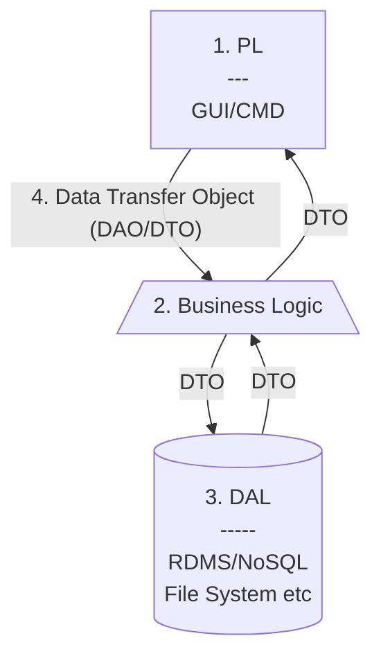

Links: [[EAD|HomePage]]
# N-Tier Architecture
- Dividing Application into n layers (conceptual). *n is just an arbritary number!* Layers Could include but not restricted to:
	1. I/O Layer or Presentation Layer (PL)
	2. Business Logic (BL)
	3. Storage or Data Access Layer (DAL)
	4. Data Transfer Object (DTO)^[DTO (Data Transfer objects) is a data container for moving data between layers. They are also termed as transfer objects. DTO is only used to pass data and does not contain any business logic. They only have simple setters and getters.]
---

---
> Give whatever you are doing and whoever you are with the gift of your attention.
> — <cite>Jim Rohn</cite>

Created: 2022-11-01