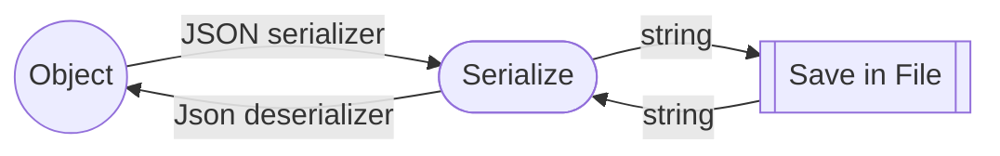

Links: [[EAD Lectures|HomePage]]

## Json Format
JSON  is an open standard file format and data interchange format that uses human-readable text to store and transmit data objects consisting of attribute–value pairs and arrays (or other serializable values).
```ad-summary

- *JSON* **data** is written as name/value pairs, A `name/value` pair consists of a field name (in double quotes), followed by a colon, followed by a value.
- *JSON* **objects** are written inside `curly braces.`
- *JSON* **arrays** are written inside `square brackets.`
```

#### Example
```json
"employees":
[  
    {"firstName":"Ahmad", "lastName":"Saif"},   
    {"firstName":"Raheem", "lastName":"Sterling"},   
    {"firstName":"Nisa", "lastName":"Sultan"}  
]
```

---

# Json Object Serialization

We can use the *JsonSerializer* class with custom types to serialize from and deserialize into.
```cs
public static class JsonSerializer
```

- Provides functionality to serialize objects or value types to JSON and to deserialize JSON into objects or value types.
- Use the WriteIndented option to format the JSON for human readability when that is helpful.
```ad-warning

For production use, you would typically accept the default value of `false` for this setting, since adding unnecessary whitespace may incur a negative impact on performance and bandwidth usage.
```


### Process


### NameSpaces
```cs
using System.Text.Json;
using System.Text.Json.Serialization;
```

---

## <u> How to write .NET objects as JSON ***</u>(serialize)***
To write JSON to a string or to a file, call the `JsonSerializer.Serialize` method.
#### Example
```cs
using System;
using System.Text.Json;
using System.Text.Json.Serialization;

class Person
{
    public int Id { get; set; }
    public string Name { get; set; }
    public int Salary { get; set; }
}

class MyProgram
{
    public static void Main()
    {
        Person p = new Person { Id = 1, Name = "Ali", Salary = 69000 };
	    string fileName = "data.json"; 
	    
	    // Object to String
        string jsonString = JsonSerializer.Serialize(p);
        Console.WriteLine(jsonString);
        
        // Save To file
        File.WriteAllText(fileName, jsonString);
    }
}

```
*The JSON output is minified (whitespace, indentation, and new-line characters are removed) by default.*

<u>OUTPUT:</u> 
`{"ID":"1","Name":"ALI","SALARY":"69000"}` ^6cdec7

```ad-info
The preceding examples use type inference for the type being serialized. An overload of `Serialize()` takes a generic type parameter:
`string jsonString = JsonSerializer.Serialize<Person>(p);`
```

^20bb2a

##### Here's an example showing how a class that contains collection properties and a user-defined type is serialized:
```cs
using System.Text.Json;

namespace SerializeExtra
{
    public class WeatherForecast
    {
        public DateTimeOffset Date { get; set; }
        public int TemperatureCelsius { get; set; }
        public string? Summary { get; set; }
        public string? SummaryField;
        public IList<DateTimeOffset>? DatesAvailable { get; set; }
        public Dictionary<string, HighLowTemps>? TemperatureRanges { get; set; }
        public string[]? SummaryWords { get; set; }
    }

    public class HighLowTemps
    {
        public int High { get; set; }
        public int Low { get; set; }
    }

    public class Program
    {
        public static void Main()
        {
            var weatherForecast = new WeatherForecast
            {
                Date = DateTime.Parse("2019-08-01"),
                TemperatureCelsius = 25,
                Summary = "Hot",
                SummaryField = "Hot",
                DatesAvailable = new List<DateTimeOffset>() 
                    { DateTime.Parse("2019-08-01"), DateTime.Parse("2019-08-02") },
                TemperatureRanges = new Dictionary<string, HighLowTemps>
                    {
                        ["Cold"] = new HighLowTemps { High = 20, Low = -10 },
                        ["Hot"] = new HighLowTemps { High = 60 , Low = 20 }
                    },
                SummaryWords = new[] { "Cool", "Windy", "Humid" }
            };

            var options = new JsonSerializerOptions { WriteIndented = true };
            string jsonString = JsonSerializer.Serialize(weatherForecast, options);

            Console.WriteLine(jsonString);
        }
    }
}
// output:
//{
//  "Date": "2019-08-01T00:00:00-07:00",
//  "TemperatureCelsius": 25,
//  "Summary": "Hot",
//  "DatesAvailable": [
//    "2019-08-01T00:00:00-07:00",
//    "2019-08-02T00:00:00-07:00"
//  ],
//  "TemperatureRanges": {
//    "Cold": {
//      "High": 20,
//      "Low": -10
//    },
//    "Hot": {
//    "High": 60,
//      "Low": 20
//    }
//  },
//  "SummaryWords": [
//    "Cool",
//    "Windy",
//    "Humid"
//  ]
//}
```


#### Serialization behavior
- By default, all public properties are serialized. You can [specify properties to ignore](https://learn.microsoft.com/en-us/dotnet/standard/serialization/system-text-json/ignore-properties).
- The default encoder^[A built-in instance of the `JavaScriptEncoder` class.] escapes non-ASCII characters, HTML-sensitive characters within the ASCII-range, and characters that must be escaped according to the *RFC 8259* JSON spec.
- By default, JSON is [[ead_lecture6#^6cdec7|minified]]. You can pretty-print the JSON.
- By default, casing of JSON names matches the *.NET names*. You can customize JSON name casing.
- By default, *circular references* are detected and **exceptions thrown.** You can preserve references and handle circular references.
- By default, fields are *ignored.* You can include fields.

#### Supported types include:

-   .NET primitives that map to JavaScript primitives, such as numeric types, strings, and Boolean.
-   User-defined plain old CLR objects (POCOs^[A POCO—or a plain old class/[[ead_lecture1#^d0e203|CLR]] object—is a .NET data structure that contains only public properties or fields. A POCO shouldn't contain any other members, such as: `methods`, `events`, `delegates`. These objects are used primarily as *data transfer objects (DTOs).* A pure POCO will not inherit another object, or implement an interface. **It's common for POCOs to be used with serialization**.]).
-   One-dimensional and jagged arrays (`T[][]`).
-   Collections and dictionaries from the following namespaces.
	- `System.Collections`
	- `System.Collections.Generic`
	- `System.Collections.Immutable`
	- `System.Collections.Concurrent`
	- `System.Collections.Specialized`
	- `System.Collections.ObjectModel`

---


## <u>How to read JSON as .NET objects ***</u>(deserialize)***
A common way to *deserialize* JSON is to first create a class with properties and fields that represent one or more of the JSON properties. Then, to deserialize from a string or a file, call the `JsonSerializer.Deserialize` method. For the generic overloads, you pass the type of the class you created as the generic type parameter. For the [[ead_lecture6#^20bb2a|non-generic overloads]], you pass the type of the class you created as a method parameter. You can deserialize either synchronously or asynchronously.
Any JSON properties that aren't represented in your class are *ignored*. Also, if any properties on the type are required but not present in the JSON payload, *deserialization will fail.*

#### Example
```cs
using System;
using System.Text.Json;
using System.Text.Json.Serialization;

class Person
{
    public int Id { get; set; }
    public string Name { get; set; }
    public int Salary { get; set; }
}

class MyProgram
{
    public static void Main()
    {
		string fileName = "data.json"; 
		string jsonString = File.ReadAllText(fileName);

        // String to Object
        Person? p = JsonSerializer.Deserialize<Person>(jsonString);
        Console.WriteLine("Name: " + p.Name);
        Console.WriteLine("Salary: " + p.Salary);
    }
}
```
*<u>OUTPUT:</u>* 
`Name: Ali`
`Salary: 69000`

```ad-tip
---
Use Visual Studio 2022 to automatically generate the class you need:
    
- Copy the JSON that you need to deserialize. 
- Create a class file and delete the template code.
- Choose **Edit** > **Paste Special** > **Paste JSON as Classes**. The result is a class that you can use for your deserialization target.
```


---
> Not what we have but what we enjoy constitutes our abundance.
> — <cite>Jean Antoine Petit-Senn</cite>


Created: 2022-11-03

