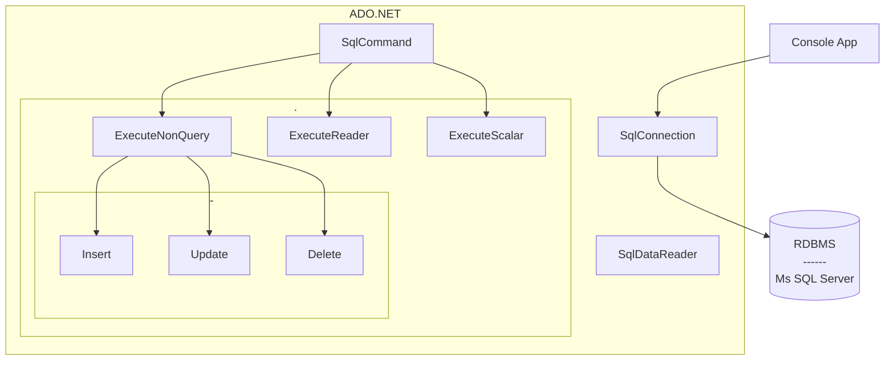

Links: [[EAD|HomePage]]
# DataBases - ADO.Net
- ADO stands for **ActiveX Data Object.**
- It is a **database access texchnology** created by Microsoft as part of it's `.NET Framework` that can access any kind of data source.
- It's a set of `classes` that provide you rich set of data components to create *high performance, reliable and scalable databse applications.* These classes are used to perform ***CRUD*** operations from data sources.
- 

## Architecture


## Package
`Microsoft.Data.sqlClient`

## Process
```cs
using System;
using System.Data.SqlClient;

class program
{
    public static void Main()
    {
        // 1. Create Connection
        string connectionString = "Something";
        SqlConnection con = new SqlConnection(connectionString); 
        con.Open();

		// 2. Make A query Command
		string query = "Select * from Table";
		SqlCommand cmd = new SqlCommand(query, con);

		// 3. Execute Query
		SqlDataReader dr = cmd.ExecuteReader();

		while (dr.Read())
		{
			//do your stuff
			Console.WriteLine(dr['col1'] + " " + dr['col2'] + "\n");
		}
		// 4. Close Connections
		dr.Close();
		con.Close();
    }
}
```


## SQLConnection
ADO.NET **connection** is an object that provides database connectivity and the entry point to a database. It is used to establish an *open connection* to the SQL Server database. An `SqlConnection` object represents a unique session to a SQL Server data source. It is a sealed class so that cannot be inherited.

`SqlConnection con = new SqlConnection(ConnectionString);`

*The connection string that includes the source database name, and other parameters needed to establish the initial connection.*
`ConnectionString = “Data Source=MyServerName;Initial Catalog=MyDatabaseName;User Id=MyUserName;Password=MyPassword;”`

**Connection does not close implicitly even it goes out of scope. Therefore, you must explicitly close the connection by calling `Close()` method.**

```ad-hint
When we have to perform an operation on database, we must have to Open and close the connection.
`con.Open()`, `con.Close()`
To ensure that connections are *always closed*, open the connection inside of a `using`^[In C#, the `using` keyword has *two purposes*: The first is the using directive, which is used to import **namespaces** at the top of a code file. The second is the using statement. C# 8 using statements ensure that classes that implement the `IDisposable` interface call their *dispose* *method*.] block.
```

```ad-summary
1. When the connection of an object is instantiated, the constructor takes a connection string that contains the information about the database server, server type, database name, connection type, and database user credentials.
2. Once the connection string is passed and the connection object is created, you can establish a connection with the database.
3. A connection string is usually stored in the **web.config** file or **app.config** file of an application.

```


## SQLCommand
The ADO.NET `SqlCommand` class in **C#** is used to store and execute the `SQL` statement against the SQL Server database. `SqlCommand` class is used to prepare an SQL statement or `StoredProcedure` that we want to execute on a *SQL Server database.*

**Represents a Transact-SQL statement or stored procedure to execute against a SQL Server database. This class cannot be inherited.**

`public sealed class SqlCommand : System.Data.Common.DbCommand, ICloneable`

#### Constructors
| Signature                                           | Behavior                                                                                           |
| --------------------------------------------------- | -------------------------------------------------------------------------------------------------- |
| `SQLCommand()`                                      | Initializes a new instance of the SqlCommand class.                                                |
| `SQLCommand(String)`                                | Initializes a new instance of the SqlCommand class with the text of the query.                     |
| `SqlCommand(String, SqlConnection)`                 | Initializes a new instance of the SqlCommand class with the text of the query and a SqlConnection. |
| `SqlCommand(String, SqlConnection, SqlTransaction)` | Initializes a new instance of the [SqlCommand](https://learn.microsoft.com/en-us/dotnet/api/system.data.sqlclient.sqlcommand?view=dotnet-plat-ext-7.0) class with the text of the query, a [SqlConnection](https://learn.microsoft.com/en-us/dotnet/api/system.data.sqlclient.sqlconnection?view=dotnet-plat-ext-7.0), and the [SqlTransaction](https://learn.microsoft.com/en-us/dotnet/api/system.data.sqlclient.sqltransaction?view=dotnet-plat-ext-7.0).                                                                                                   |

#### Methods
| Signature           | Behavior                                                                                                                                                                                                                                                                                                                              |
| ------------------- | ------------------------------------------------------------------------------------------------------------------------------------------------------------------------------------------------------------------------------------------------------------------------------------------------------------------------------------- |
| `ExecuteReader()`   | Sends the **CommandText** to the **Connection** and builds a *SqlDataReader*. It is used when the SQL statement returns more than a single value. For example, if the query returns rows of data like all employee details.                                                                                                           |
| `ExecuteNonQuery()` | Executes a **Transact-SQL** statement against the connection and returns the number of *rows affected.* It is used when you want to perform an Insert, Update or Delete operation like update or Delete an employee detail or insert employee data.                                                                                   |
| `ExecuteScalar()`   | Executes the query, and returns the *first column of the first row* in the result set returned by the query. Additional columns or rows are ignored. It is used when the query returns a **single(scalar)** value. For example, queries that return the total number of rows in a table, or the employee who gets highest salary etc. |
| `Prepare()`         | Creates a *prepared* version of the command on an instance of *SQL Server.*                                                                                                                                                                                                                                                           |
| `Clone()`           | Creates a new `SqlCommand` object that is a copy of the current instance.                                                                                                                                                                                                                                                             |

```ad-warning
----
You can reset the `CommandText` property and reuse the `SqlCommand` object. However, you must **close** the `SqlDataReader` before you can execute a new or previous command.
```

## SQLDataReader
ADO.NET **DataReader** object is used for accessing data from the data source. Provides a way of reading^[If you want to make modification in retrieved data you need to use `DataAdapter` instead of `DataReader`.] a forward-only stream of rows from a SQL Server database. This class cannot be inherited.

`public class SqlDataReader : System.Data.Common.DbDataReader, IDisposable, System.Data.Common.IDbColumnSchemaGenerator`

To create a `SqlDataReader`, you must call the `ExecuteReader` method of the `SqlCommand` object, instead of directly using a **constructor.**

```ad-warning
---

When using sequential access ([CommandBehavior.SequentialAccess](https://learn.microsoft.com/en-us/dotnet/api/system.data.commandbehavior?view=dotnet-plat-ext-6.0#system-data-commandbehavior-sequentialaccess)), an [InvalidOperationException](https://learn.microsoft.com/en-us/dotnet/api/system.invalidoperationexception?view=dotnet-plat-ext-6.0) will be raised if the [SqlDataReader](https://learn.microsoft.com/en-us/dotnet/api/system.data.sqlclient.sqldatareader?view=dotnet-plat-ext-6.0) position is advanced and another read operation is attempted on the previous column.
```

#### Properties
| Signature            | Behaviour                                                                                              |
| -------------------- | ------------------------------------------------------------------------------------------------------ |
| `Connection`         | Gets the `SqlConnection` associated with the `SqlDataReader`.                                              |
| `Depth	`             | Gets a value that indicates the **depth** of nesting for the current row.                                  |
| `FieldCount	`        | Gets the **number of columns** in the current row.                                                         |
| `HasRows	`           | Gets a value that indicates whether the `SqlDataReader` contains *one or more rows.*                       |
| `IsClosed	`          | Retrieves a `Boolean` value that indicates whether the specified `SqlDataReader` instance has been **closed**. |
| `Item[Int32]	`       | Gets the value of the specified column in its native format given the *column ordinal.*                  |
| `Item[String]	`      | Gets the value of the specified column in its native format given the *column name.*                     |
| `RecordsAffected	`   | Gets the *number of rows* changed, inserted, or deleted by execution of the **Transact-SQL statement.**      |
| `VisibleFieldCount	` | Gets the *number* of fields in the `SqlDataReader` that are **not hidden.**                                                                                                       |

#### Methods
| Signature        | Behaviour                                                                                                                                  |
| ---------------- | ------------------------------------------------------------------------------------------------------------------------------------------ |
| `Read()`         | It Advances the `System.Data.SqlClient.SqlDataReader` to the next record and returns **true** if there are more rows; otherwise **false.** |
| `GetName(int i)` | It gets the name of the specified column. Here, parameter i is the *zero-based column ordinal.*                                            |
| `NextResult()`   | It advances the data reader to the next result when reading the results of **batch** *Transact-SQL statements.*                                                                                                                                           |

## End
---
> Freedom is not worth having if it does not connote freedom to err.
> — <cite>Mahatma Gandhi</cite>

Created: 2022-11-08