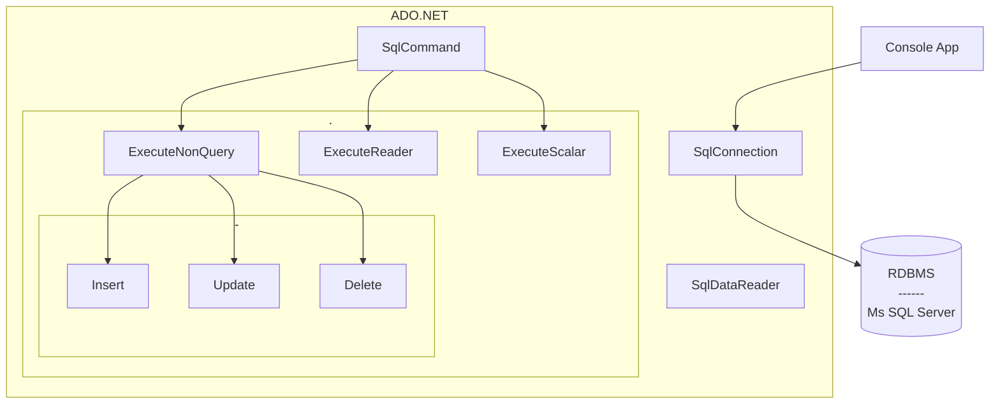

Links: [[EAD|HomePage]]
# DataBases - ADO.Net

## Architecture


## Package
`Microsoft.Data.sqlClient`

## Process
```cs
using System;

class program
{
    public static void Main()
    {
        // 1. Create Connection
        string connectionString = "Something";
        SqlConnection con = new SqlConnection(connectionString); 
        con.Open();

		// 2. Make A query Command
		string query = "Select * from Table";
		SqlCommand cmd = new SqlCommand(query, con);

		// 3. Execute Query
		SqlDataReader dr = cmd.ExecuteReader();

		while (dr.Read())
		{
			//do your stuff
			Console.WriteLine(dr['col1'] + " " + dr['col2'] + "\n");
		}
		// 4. Close Connection
		con.Close();
    }
}
```


## API


---
> Freedom is not worth having if it does not connote freedom to err.
> — <cite>Mahatma Gandhi</cite>

Created: 2022-11-08